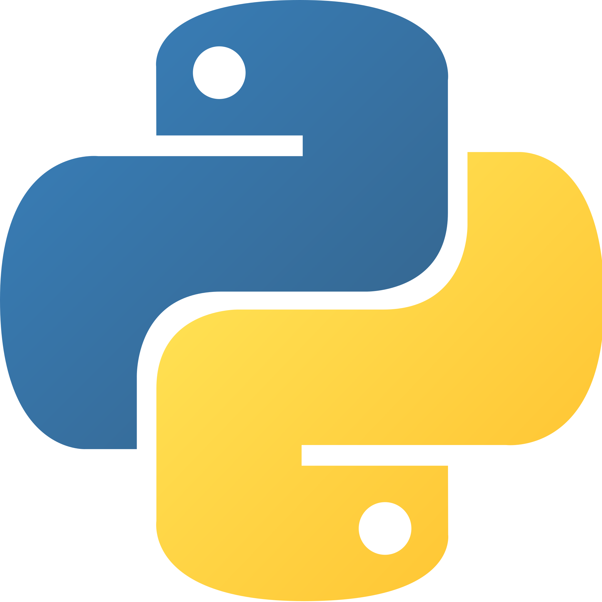

<!-- Description about me -->
<h2 align="center"> 👋 Hey there! I'm Rafael Moncayo Pérez </h2>

  <code>Rafamp34</code> · 📍 Málaga, Spain 🇪🇸

  🎓 <b>Técnico Superior en DAM</b> — C.P.I.F.P Alan Turing 
  🤖 Specializing in <b>Artificial Intelligence & Big Data</b> — DigitechFP

  Passionate about building meaningful software and turning data into insights. 
  Always learning, always curious, and eager to take on new challenges 🚀

  📨 <b>Open to work</b> — Let's connect and build something great together! 
  <a href="mailto:rafaelmoncayop37@gmail.com">rafaelmoncayop37@gmail.com</a> · <a href="https://www.linkedin.com/in/rafael-moncayo-p%C3%A9rez-083724268/">LinkedIn</a>

   
<h3>🧐 More About Me:</h3>
<table>
  <tr>
    <td valign="top" width="60%">
      <ul>
        <li>🔭 Currently studying <b>AI & Big Data</b> at <b>DigitechFP</b></li>
        <li>🌱 Learning <b>PySpark, Hadoop, Docker, Machine Learning & Deep Learning</b></li>
        <li>🐍 Working with <b>Python, Java, TypeScript, Angular & Ionic</b></li>
        <li>👨🏻‍💻 Check out my projects on <a href="https://github.com/Rafamp34?tab=repositories">Github</a></li>
        <li>💬 Happy to chat about anything tech related</li>
        <li>🐶 When I'm free, I enjoy spending time outdoors with my dogs</li>
      </ul>
    </td>
    <td valign="center" width="40%" align="center">
      
    </td>
  </tr>
</table>
   

        
<!-- languages and skills section -->
<h1 align="center"> Languages & Frameworks: </h1>

  
  <code></code>
  <code></code>
  <code></code>
  <code></code>
  <code></code>
  <code></code>
  <code></code>
  <code></code>

 
<h1 align="center"> Data & AI: </h1>

  <code></code>
  <code></code>
  <code></code>
  <code></code>
  <code></code>

 
<h1 align="center"> Tools & Environments: </h1>

  <code></code>
  <code></code>
  <code></code>
  <code></code>
  <code></code>
  <code></code>

 

 

<!-- last refresh of readme section -->
Last refresh: <b> Saturday, April 19, 2026 12:00 (UTC +02:00)</b>
